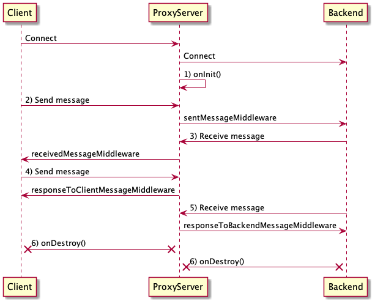

# Sequence



## Connect

Client에서 Backend로의 커넥션이 연결되면, `proxy.onInit()` 함수에 등록된 함수가 호출됩니다.

```ts
proxy.onInit(() => {
  console.log("connected");
});
```

## Disconnect

클라이언트에서 백엔드로의 커넥션이 종료되면, `proxy.onDestroy()` 함수에 등록된 함수가 호출됩니다.

```ts
proxy.onDestroy(() => {
  console.log("destroyed");
});
```

## 메시지 송신

클라이언트에서 백엔드로 메시지를 보내게 되면, `proxy.addSentMessageMiddleware()` 에 등록된 함수들이 순서대로 호출됩니다.

각 미들웨어 함수의 반환값이 다음 미들웨어의 입력값으로 전달되며, 마지막 미들웨어의 반환값이 백엔드로 전달됩니다.

만일 미들웨어에서 `null` 또는 `undefined` 값을 반환하는 경우 더 이상 미들웨어를 호출하지 않고, 클라이언트에서 보낸 메시지를 백엔드로 전달하지 않습니다.

```ts
proxy.addSentMessageMiddleware(
  (message: string | Message) => JSON.parse(message),
  (message: string | Message) => {
    message.extraData = "FooBar";
    return message;
  },
  (message: string | Message) => JSON.stringify(message),
);
```


## 메시지 수신

백엔드에서 클라이언트로 메시지를 보내게 되면, `proxy.addReceivedMessageMiddleware()` 에 등록된 함수들이 순서대로 호출됩니다.

각 미들웨어 함수의 반환값이 다음 미들웨어의 입력값으로 전달되며, 마지막 미들웨어의 반환값이 클라이언트로 전달됩니다.

만일 미들웨어에서 `null` 또는 `undefined` 값을 반환하는 경우 더 이상 미들웨어를 호출하지 않고, 백엔드에서 보낸 메시지를 클라이언트로 전달하지 않습니다.

```ts
proxy.addReceivedMessageMiddleware(
  (message: string | Message) => JSON.parse(message),
  (message: string | Message) => {
    // TickEvent 무시
    if (message === "TickEvent") {
      return null;
    }
    return message;
  },
  (message: string | Message) => JSON.stringify(message),
);
```
